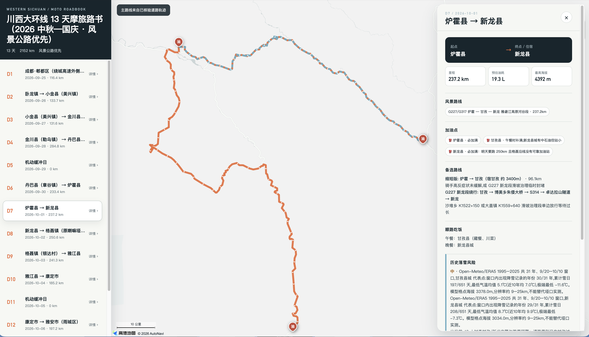

# Western Sichuan Motorcycle Roadbook Planner · moto-travel-western-sichuan

**English** · [中文](README.md)

A roadbook toolkit that turns "how do I ride a motorcycle through Western Sichuan" from a vague idea into something **executable, re-checkable, and exportable**.

It rejects the "string the scenic spots together" approach and works in reverse instead: **first pick the continuous scenic roads worth riding, then fill in with a small number of scenic spots**; holiday crowd / traffic avoidance, historical snow risk, altitude acclimatization pace, and fuel range are treated as hard constraints rather than footnotes; finally it outputs a Markdown roadbook with real road geometry, an Excel workbook, and an Amap web page.

> Scope: motorcycle (not car) trip planning for Ngawa (Aba) Prefecture and Garzê (Ganzi) Prefecture in Sichuan.
> **Not applicable to**: self-driving by car, areas outside Western Sichuan, real-time emergency command, nor may this tool be treated as an authoritative conclusion on medical, traffic-enforcement, or road-open status.

---

## Disclaimer

**Read this first: every roadbook this tool produces is only "a suggestion". It is not an authoritative conclusion and comes with no guarantee whatsoever.**

Specifically this covers: route alignment, mileage, altitude, time and fuel-consumption estimates, weather and historical snow ratings, ticket prices and reservation requirements, lodging and fuel stops, and judgments about traffic controls and road closures, as well as anything related to health, medical care, or gear. All of it is derived from public materials, map routing, and third-party weather data, and **Western Sichuan's weather, road conditions, traffic controls, scenic-area policies, and gas-station operating status change very quickly — this content may already be out of date, and may have been wrong from the start**.

By using it you understand and agree:

- **Ride within your limits.** Plateau riding carries real risk, and this tool cannot assess your fitness, riding skill, altitude acclimatization, bike condition, or experience. **The route difficulty rating only describes road conditions; it does not mean the route suits you**; anywhere you cannot ride or cannot judge, turning around or not going is the correct decision.
- **Handle altitude sickness (AMS) by your body's signals, not by the plan.** When symptoms appear, do not keep increasing sleeping altitude; if it worsens after resting at the same altitude, or if resting dyspnea, unsteady gait, or altered consciousness appears, **descend immediately and seek medical care**. A small portable oxygen canister cannot replace descent or medical treatment. Blood-oxygen readings must be judged together with altitude, trend, symptoms, and device error; a single threshold cannot replace a diagnosis. **A trip can be cancelled; a body cannot be redone.**
- **Re-check all key information yourself before departure.** Following the "pre-departure re-check list" in the roadbook, check official channels once 1 week before departure, once at 48 hours, and once on the morning of departure; **official announcements and on-site traffic signs are final**, and do not substitute this tool's conclusions for the judgment of traffic police, highway administration, or people on site.
- **Obey local regulations.** For example, motorcycles are banned from Sichuan expressways, and two-wheelers above 150cc are banned inside (and within) the Chengdu Ring Expressway (G4202). The consequences of entering a prohibited road are borne by the rider.
- **You bear the risk yourself.** The authors and contributors **accept no liability whatsoever** for any personal injury, property damage, trip loss, or legal consequence arising from consulting this tool. This tool does not replace your independent judgment, professional guidance, rescue services, or insurance — **you must buy travel insurance that includes high-altitude rescue and a valid riding accident insurance policy**.

For the complete technical limitations, see "[Known Limitations](#known-limitations)" at the end of this document.

---

## Table of Contents

- [Disclaimer](#disclaimer)
- [What Problem It Solves](#what-problem-it-solves)
- [Quick Start](#quick-start)
- [API Key Applications](#api-key-applications)
- [Directory Structure](#directory-structure)
- [Workflow](#workflow)
- [Script Reference](#script-reference)
- [Roadbook JSON Data Model](#roadbook-json-data-model)
- [Data Sources and Fallback Chain](#data-sources-and-fallback-chain)
- [Outputs](#outputs)
- [Known Limitations](#known-limitations)
- [License](#license)

---

## What Problem It Solves

The pitfalls that are easiest to hit when planning a Western Sichuan motorcycle trip are exactly the ones that "look fine":

| Pitfall | Consequence | What this skill does |
|---|---|---|
| Using car routing directly as the motorcycle route | The shortest path it computes usually goes onto an expressway, and **motorcycles are banned on Sichuan expressways** (Article 41 of the Sichuan Provincial Expressway Regulations, 《四川省高速公路条例》第四十一条) | Always set `strategy=6` (no expressways) for routing; after export, scan the road composition again and return for correction if an expressway segment shows up |
| Treating scenic areas as the main line | A whole day disappears into parking lots and shuttle buses, while the scenery on the road goes unseen | The main route must be a **continuous scenic road**; every riding day must write at least one `scenic_routes` entry explaining why it is worth riding and the best light |
| Riding straight up to 4000m to sleep | Altitude sickness (AMS) | First night ≤2600m; once above 3000m, sleeping altitude in principle increases by ≤500m per day; Litang (理塘, 4014m) is pass-through only, never an overnight stay |
| Judging snow by temperature instead of altitude | Missing black ice on the passes | Rate each day by **date + pass altitude + historical same-period data**, write it into `snow_risk`; high risk must come with `no_go_conditions` |
| Computing range from low-altitude fuel consumption | Running dry on the plateau | `fuel_planner.py` gives the maximum safe fuel-stop interval; fuel deserts are listed separately (S451 (Jinxiaolu / 金小路), Genie / Gnye (格聂), Litang–Yajiang (理塘—雅江)…) |
| Deciding on the user's behalf whether to shift timing | Losing the road the user most wants to ride | Crowd / traffic avoidance must be the user's choice, written into top-level `crowd_avoidance`; if not enabled, still record `mode: accept` |

There is also one hard engineering requirement: **the main route of a detailed roadbook must be real road geometry returned by a map service** (`route_geometry`); faking a route by drawing a straight line between start and end coordinates is not allowed — `validate_roadbook.py` will stop such a roadbook.



---

## Quick Start

### 1. Dependencies

```bash
pip install -r requirements.txt      # openpyxl>=3.1,<4 (needed only for Excel export)
```

Python 3.9+. Core validation, fuel, budget, and HTML export use only the standard library; `openpyxl` is used only for Excel export.

### 2. Loading as a Skill

Put this directory into your skills directory (Claude Code / Kimi Code, etc.), or link it into a project scope:

```bash
# Example: this project's scope
mkdir -p <project-root>/.kimi-code/skills
ln -s "$PWD" <project-root>/.kimi-code/skills/moto-travel-western-sichuan
```

Once loaded, mentioning "川西摩旅 / 格聂 / 金小路 / S434 / 折多山 / 稻城亚丁 / 四姑娘山 路书" (Western Sichuan motorcycle trip / Genie / Jinxiaolu / S434 / Zheduo Pass / Daocheng Yading / Mount Siguniang roadbook) will trigger it.

### 3. External Capabilities Required

This skill **is not bound to any single MCP**; before running it probes what the current environment actually has, and falls back when something is missing.

| Purpose | Preferred | Fallback |
|---|---|---|
| Routing / mileage / road geometry / POI | Amap (Web Service Key + REST or MCP) | Baidu Maps MCP |
| Weather / historical same-period / alerts | QWeather | Open-Meteo (no Key needed, includes history and forecast) |
| Lodging availability | Fliggy FlyAI | Give node strategy and price ranges; the user books on their own |
| En-route intel | Xiaohongshu | Web search |
| Temporary traffic controls | **No single API is reliable**, see `references/road-conditions.md` | Official channels + on-site verification |

Configuration details are in [`references/mcp-setup.md`](references/mcp-setup.md).

> **Key discipline**: API Keys are not written into the roadbook JSON, skill files, the repository, or chat messages. Provide them through environment variables or the client's local MCP configuration.
> For the Amap JS API **security key**, the official documentation recommends a server-side proxy; embedding it directly in the exported HTML is only suitable for local personal use — **do not share it publicly or commit it to a repository**.

### 4. Run It Once

```bash
python3 scripts/fuel_planner.py --tank 22 --consumption 7.0
python3 scripts/validate_roadbook.py roadbook.json
python3 scripts/budget_estimator.py roadbook.json --tier comfort
python3 scripts/export_excel.py roadbook.json -o 路书.xlsx
AMAP_JS_KEY=... AMAP_JS_SECURITY_CODE=... \
  python3 scripts/export_html.py roadbook.json -o 路书.html
```

---

## API Key Applications

This skill binds no paid service, but **full capability requires the following Keys**. All of them can be covered using free quotas alone; the parts you do not need (for example, no map export or no weather alerts) can be skipped.

> **Key discipline**: always go through **environment variables** or the client's local MCP configuration. Do not write Keys into the roadbook JSON, skill files, the repository, or chat messages. This repository's `.gitignore` already excludes `*.html` / `*.xlsx` / `roadbook.json`, because exported HTML may embed the Amap JS Key and security key.

### 1. Amap —— you need **two different types** of Key

This is the easiest place to get tripped up: **the Key used for routing and the Key used for the map web page are two different things and cannot substitute for each other**.

#### (a) Web Service Key —— routing, geocoding, POI

Purpose: `/v3/direction/driving` (get real road geometry), `/v3/geocode/geo` (address to coordinates), POI search.

1. Register and log in to [Amap Open Platform](https://lbs.amap.com/)
2. Go to [Console → Application Management → My Applications](https://console.amap.com/dev/key/app) and **create a new application**
3. Under that application **add a Key**, and **select "Web Service" as the service platform**
4. Note the Key down and configure it as an environment variable for the scripts and MCP:

```bash
export AMAP_KEY='your Web Service Key'
# If using the official MCP:
#   Streamable HTTP: https://mcp.amap.com/mcp?key=<Web Service Key>
#   or Node stdio:   npx -y @amap/amap-maps-mcp-server   (environment variable AMAP_MAPS_API_KEY)
```

**Quota and rate limits**: individual developers get a free daily quota with a **QPS limit**. One complete 13-day Western Sichuan plan consumes roughly 100–300 calls (geocoding ~90 + segment-by-segment routing ~30 + retries). When the QPS cap is hit the API returns `CUQPS_HAS_EXCEEDED_THE_LIMIT`; you **must rate-limit and retry with backoff** — do not hammer it in a loop.

> ⚠️ **Motorcycle routing cannot be made legal by using "driving"**: Sichuan bans motorcycles on expressways, and driving routing defaults to expressways. This skill uses `strategy=6` (no expressways) and then **scans the road names in the returned result once more before export**, returning for correction when "高速 / 快速路" (expressway / express road) wording appears. Even so, on-site signs remain authoritative.

#### (b) Web (JS API) Key + security key —— exporting the map web page

Purpose: the Amap JS API 2.0 page generated by `scripts/export_html.py`.

1. Under **the same application**, add another Key, and **select "Web (JS API)" as the service platform**
2. On the same page click "**View security key**" to get the security key (Keys applied for after 2021-12-02 must be paired with a security key to work)
3. Pass them in at export time:

```bash
export AMAP_JS_KEY='your Web (JS API) Key'
export AMAP_JS_SECURITY_CODE='your security key'
python3 scripts/export_html.py roadbook.json -o 路书.html
```

You can export without passing these two variables; the page will guide you to enter them temporarily in the browser (stored only in sessionStorage, invalid after refresh).

> ⚠️ **Do not make the security key public.** The exporter embeds it into the HTML by default (`window._AMapSecurityConfig`), which is only suitable for **local personal use**. To share or deploy, follow Amap's official "JS API security key usage" documentation and switch to a **server-side proxy**, and do not commit key-bearing HTML to a repository or post it to a public link.

### 2. QWeather —— note that "credential ID ≠ API Host"

Purpose: extra-long-window forecasts (30 days, enough to cover the whole trip) and **disaster alerts**.

1. Register and log in to the [QWeather Console](https://console.qweather.com/)
2. **Create a Project**, then **create a credential** under the project (API Key; JWT is also possible for paid scenarios)
3. **The critical step**: go to [Console → Settings](https://console.qweather.com/setting) and copy your **API Host**, in the form `xxxxxxxxxx.re.qweatherapi.com`

   This step is the source of the vast majority of 403s:

   - **The API Host is randomly assigned by the system and unique to each account**, and **it is not the same thing as the "credential ID"** — guessing the Host from the credential ID will always fail
   - The vendor states explicitly that **the API Host itself is part of authentication**, so it counts as a credential too; do not leak it
   - Using the wrong Host gives you `403 Invalid Host`. **This error has nothing to do with the Key** — do not keep swapping Keys just because you saw a 403

4. Request form (note that coordinates are **longitude,latitude**):

```bash
export QW_HOST='https://xxxxxxxxxx.re.qweatherapi.com'
export QW_KEY='your API Key'
# 30-day forecast
curl -s "$QW_HOST/v7/weather/30d?location=101.96,29.99&key=$QW_KEY"
# real-time disaster alerts (new endpoint)
curl -s "$QW_HOST/weatheralert/v1/current/29.99/101.96?key=$QW_KEY"
```

5. The two endpoints this skill uses:

| Endpoint | Purpose | Notes |
|---|---|---|
| `/v7/weather/30d` | 30-day forecast covering the entire trip window | Free quota is counted by request volume; a full run is about 46 requests |
| `/weatheralert/v1/current/{lat}/{lon}` | Real-time disaster alerts (snowfall / cold wave / high wind) | **Must use v1** |

> ⚠️ The old `/v7/warning/now` **has been deprecated by the vendor** (service ends 2026-10-01); continuing to use it only gets you 403 Deprecated.
>
> ⚠️ **The 30-day product is grid-cell level and cannot distinguish high-altitude passes**: in testing, multiple coordinates in the same grid cell return exactly identical values (Balangshan Tunnel (巴朗山隧道) == Siguniangshan Town (四姑娘山镇), Wanlicheng Liangzi Pass (万里城梁子) == Jinchuan (金川) county town, Xinduqiao (新都桥) == Tagong (塔公) == Yala Pass (雅拉山口) == Zheduo Pass (折多山) == Kangding (康定)); it reports the temperature of the Jinchuan river valley as the temperature of the 4540m Wanlicheng Liangzi Pass. **Judging black ice/snowfall on passes requires an altitude-modeled data source** (such as Open-Meteo); QWeather is better for looking at large-scale weather patterns.

### 3. Open-Meteo —— no Key, used as a fallback and for cross-validation

**No registration required**; call it directly. This skill uses it for three things:

| Purpose | Endpoint |
|---|---|
| Historical same-period climate statistics (from 1995, ERA5) | `archive-api.open-meteo.com/v1/archive` |
| Elevation sampling along real road geometry (Copernicus DEM) | `api.open-meteo.com/v1/elevation` |
| Forecast (16 days, modeled on real elevation) | `api.open-meteo.com/v1/forecast` |

Things to note:

- **The free quota limits request volume per minute/hour/day**; burst requests return `429 Too Many Requests`, so you must rate-limit and retry with backoff.
- A pitfall found in testing: requests from this machine's Python `urllib` get **persistently** 429'd, while `curl` returns normally at the same moment (apparently related to egress IP / TLS fingerprint). So this skill routes all Open-Meteo requests through a `curl` subprocess — keep this in mind when looking at the data-fetching scripts outside this repository or when implementing your own.
- When the API is unavailable, **do not make up data**: mark the conclusion as "unknown" and treat it as medium risk.

### 4. Optional Capabilities

| Capability | Service | How to obtain | Notes |
|---|---|---|---|
| Lodging / ticketing | Fliggy FlyAI | See `references/mcp-setup.md` | No Key, plug and play; status subject to official documentation |
| Alternative routing | Baidu Maps | [Baidu Maps Open Platform](https://lbsyun.baidu.com/) → create application → **server-side AK** | Supports HTTP/SSE/stdio MCP; for when Amap is unavailable |
| En-route intel | Xiaohongshu (community MCP) | Run the service locally then configure the client; requires **QR-code login** | ⚠️ Unofficial reverse engineering, **account-ban risk, use a throwaway account**; leads only, it cannot prove a road is open |
| Train tickets (backup for motorcycle shipping / separating rider and bike) | 12306 (community MCP) | `npx -y 12306-mcp` | No login required |

### 5. Running Only Validation and Export — No Key Needed

```bash
python3 scripts/validate_roadbook.py roadbook.json     # pure local validation
python3 scripts/fuel_planner.py --tank 22 --consumption 7.0
python3 scripts/budget_estimator.py roadbook.json
python3 scripts/export_excel.py roadbook.json -o 路书.xlsx
python3 scripts/build_roadbook.py roadbook.json --output-dir roadbook-output
python3 -m unittest discover -s tests                  # 21 unit tests
```

**Keys are needed in only two places**: **fetching data** from map/weather services during the planning stage (sections 1, 2, 3), and exporting the HTML map page (section 1(b)). Once the roadbook JSON has taken shape, validation, budget, Excel, and Markdown are all purely offline.

---

## Directory Structure

```
moto-travel-western-sichuan/
├── SKILL.md                         Skill body: core principles, dependency pre-check, 7-step workflow
├── requirements.txt                 Excel export dependency
├── references/                      Domain knowledge + rules + schema (read on demand, see below)
│   ├── western-sichuan-knowledge.md  Classic loop templates, pass altitude table, fuel deserts, scenic-area reservations, seasonal scenery, gear and AMS
│   ├── roadbook-schema.md            Field rules for the roadbook JSON data model
│   ├── roadbook.schema.json          Machine-checkable JSON Schema (2020-12)
│   ├── planning-policy.md            User-controlled holiday crowd avoidance, scenic-road scoring, historical snow-risk decision rules
│   ├── road-conditions.md            Official channels for querying temporary traffic controls + search templates
│   ├── mcp-setup.md                  Connection configuration notes for each MCP
│   ├── pipeline.md                   One-command build and lodging prefetch workflow
│   └── niche-routes.md               20 niche / through-route candidates and their verification status
├── scripts/
│   ├── roadbook_utils.py            Shared: validation, fuel estimation, WGS-84/BD-09 → GCJ-02 coordinate conversion
│   ├── build_roadbook.py            Validate and export Markdown/HTML/Excel in one command
│   ├── validate_roadbook.py         Roadbook validation (must run before export)
│   ├── fuel_planner.py              Maximum safe fuel-stop interval by bike model + fuel desert check
│   ├── budget_estimator.py          Categorized budget (fuel / lodging / meals / tickets / contingency)
│   ├── fetch_lodging.py             FlyAI batch queries, caching, backoff, and coordinate checks
│   ├── export_markdown.py           Generic Markdown roadbook exporter
│   ├── export_excel.py              Day-by-day roadbook Excel (high risk colored, gap day gray, total fuel summary)
│   └── export_html.py               Single-file Amap JS API 2.0 map roadbook
└── tests/
    └── test_core.py                 21 unit tests for validation, build, lodging, coordinates, and exports
```

**references are read on demand** — do not read them all at once; read them only when you reach the corresponding stage (for example, read `roadbook-schema.md` only when entering the output stage).

---

## Workflow

The 7 steps defined by `SKILL.md`:

1. **Gather requirements** — origin / number of days / dates, bike model (displacement · tank · measured fuel consumption → range), rider experience and companions, pace tier (relaxed ≤200km / normal 200–300km / hardcore 300km+), **holiday crowd-avoidance choice (must ask the user)**, scenery preferences, snow-risk tolerance, paved / unpaved preference, budget tier.
   If you cannot ask everything, **make reasonable assumptions and state them**; do not silently decide for the user.
2. **Route planning (two levels)** — first produce a **rough route** (per-day start/end + mileage + lodging point + highest altitude of the day) for the user to decide on; after confirmation, produce the **detailed route** (adding road geometry, continuous scenic segments, waypoints, passes, road conditions, fuel, alternatives).
   Candidate route scoring order: continuous scenic quality > motorcycle access and surface credibility > historical snow / geohazard risk > user crowd-avoidance constraints > supply and lodging > number of scenic spots.
3. **Fuel stop planning** — `fuel_planner.py` + the fuel desert list; county-town nodes are filled up first.
4. **Weather and gear** — historical same period (pick representative points by altitude; do not use a low-altitude county town to represent a high pass) + forecast + alerts, writing `snow_risk` per day; provide layered clothing, vehicle preparation, tools, medication, and blood-oxygen discipline.
5. **Lodging recommendations** — 2–3 options per night (price, altitude, oxygen supply / underfloor heating); for long holidays, book 1–2 months in advance.
6. **Reservations, dynamic verification, and compliance** — verify ticket price / opening hours / reservation requirements for every paid scenic area and **record the source and query date**; if it cannot be found, mark it "to be re-checked". Includes the document checklist, checkpoints, and no-drone zones.
7. **Output the roadbook** — generate JSON → validate → export Markdown / Excel / HTML.

At the output stage, prefer the one-command pipeline:

```bash
python scripts/build_roadbook.py roadbook.json --output-dir roadbook-output
```

Two more cross-cutting mechanisms:

- **gapDays (gap day / buffer day)**: the reference baseline is 1 per 4–5 riding days; increase it in the rain/snow season, on unpaved roads, with novice companions, or with consecutive high-altitude overnights. `Total days = riding days + gap ≤ vacation`; when the safety buffer does not fit, **shorten the route and explain why** — do not force it by cutting rest or by riding absurdly long days.
- **Daily plan B**: every riding day must give a replacement plan for bad weather / traffic controls / closures / AMS.
- **Niche route funnel**: anything with an incomplete route name / start-end / geometry is marked `unverified` and may only enter the candidate list, never the day-by-day formal route; technical difficulty 4–5 must first satisfy recent road-condition evidence, real geometry, supply-and-range check, bailout points, prohibition check, weather window, and no-go conditions.

---

## Script Reference

### `fuel_planner.py` —— fuel planning

```bash
python scripts/fuel_planner.py --tank 22 --consumption 7.0 [--reserve-km 30]
```

Based on "theoretical low-altitude range × conservative derating factor (default 0.75) − reserve", it gives the **maximum safe fuel-stop interval** and checks each known fuel-desert segment one by one for exceedance.

> The derating factor is only a conservative **planning parameter**, not a law of physics; it must be corrected with this bike's measured figures under similar load / road conditions.

### `validate_roadbook.py` —— must run before export

```bash
python scripts/validate_roadbook.py roadbook.json
```

The machine validation rules are in `references/roadbook.schema.json`. It will stop these cases:

- A detailed route missing `route_geometry` (real road geometry) or `route_source`
- A detailed riding day missing `scenic_routes` / `alternative_routes` / `schedule` / `meals` / `crowd_avoidance` / `snow_risk` / `plan_b`
- `technical_difficulty` of 4–5 while missing `route_evidence` / `bailout_points` / `no_go_conditions`
- `snow_risk.level = 高` without `no_go_conditions`
- A missing or mixed coordinate system

### `budget_estimator.py` —— categorized budget

```bash
python scripts/budget_estimator.py roadbook.json --tier comfort [--fuel-price 8.2]
```

Tiers: `economy` / `comfort` / `premium`. Outputs fuel, lodging, dining, tickets, contingency (default 12%), and the per-day distribution. The fuel-consumption basis matches the Excel export.

### `export_excel.py` —— day-by-day roadbook sheet

```bash
python scripts/export_excel.py roadbook.json -o 路书.xlsx
```

Fields: date, weather / clothing, altitude, start and end, surface / difficulty / confidence, scenic points, closure likelihood, gas stations, dining, backup plan, estimated fuel consumption. High / medium risk is colored, gap day has a gray background, and total fuel consumption is summarized at the end.

Fuel-consumption basis: `里程 × 油耗/100 × (1 + 2%/1000m 终点海拔) × 1.08 + 0.15L/1000m 累计爬升` (mileage × consumption/100 × (1 + 2% per 1000m of destination altitude) × 1.08 + 0.15L per 1000m of cumulative climb).

### `export_html.py` —— Amap map roadbook

```bash
AMAP_JS_KEY=... AMAP_JS_SECURITY_CODE=... \
  python scripts/export_html.py roadbook.json -o 路书.html
```

A single-file application on Amap JS API 2.0. The daily list is on the left and the map on the right; each "detail" opens the `#day-N` daily detail (start and end, scenic routes, mileage, estimated fuel consumption, fuel stops, alternative routes, meal stops, crowd-avoidance arrangements, historical snow risk, road conditions).

- When no Key is configured, the page guides you to enter it temporarily in the browser (stored only in sessionStorage).
- The main route is drawn snapped to the road using `route_geometry`; only when there is a rough route (no geometry) will it call `AMap.Driving` to route on the fly, **marking it with a dashed line as "check for motorcycle ban / expressway"**.
- At export time, all coordinates in the JSON are converted to the GCJ-02 that Amap requires.

### Tests

```bash
cd moto-travel-western-sichuan && python -m unittest discover -s tests
```

The 9 cases cover: positive and negative cases for the validation rules, WGS-84→GCJ-02 conversion, Excel formula-injection protection, HTML `</script>` escape protection, and embedded JS syntax.

---

## Roadbook JSON Data Model

Top level:

```json
{
  "title": "川西大环线13天摩旅",
  "coordinate_system": "gcj02",
  "crowd_avoidance": { "mode": "avoid", "locations": ["折多山垭口"], "date_ranges": ["2026-10-01/2026-10-03"] },
  "rider": { "tank_l": 22, "consumption_l_per_100km": 7.0 },
  "days": [ /* ... */ ]
}
```

`coordinate_system` is required and **must not be mixed within one file** (Amap GCJ-02 / Baidu BD-09 / GPS·OSM WGS-84).
`crowd_avoidance.mode` must be `avoid` or `accept`, and must reflect the **user's choice**.

Key fields for each riding day in `days[]`:

| Field | Description |
|---|---|
| `route_geometry` | Real road geometry returned by the map service, `[[lng,lat],...]` |
| `route_source` | `{provider, strategy, checked_at}` |
| `scenic_routes` | Continuous scenic roads / road segments (not a list of scenic spots), with the reason for choosing them and the best light |
| `alternative_routes` | Executable alternatives + trigger conditions |
| `surface` / `technical_difficulty` / `route_confidence` | Surface composition / technical difficulty 1–5 / `verified`·`recent-community-lead`·`unverified` |
| `bailout_points` / `no_go_conditions` | Bailout points / conditions requiring abandoning the route or turning back (mandatory at difficulty 4–5 and for high snow risk) |
| `snow_risk` | `{level: 低/中/高/未知, basis, checked_at, action}`; percentages must not be fabricated without evidence |
| `road_closure_risk` | Rated **separately** from snow: this one describes only road controls / geohazards |
| `schedule` / `meals` / `crowd_avoidance` / `plan_b` | Time-blocked schedule (passes and long hikes in the morning) / en-route dining / this day's crowd-shifting implementation / the day's backup plan |

Three rules that are easy to overlook:

1. **The `date` of a gap day is `null`**; when it is not bound to a date, do not disguise "contingency" as a date.
2. Fill in `route_geometry` only when the map service returns road geometry; manually connecting scenic-spot coordinates **does not** count as road geometry.
3. For tunnel segments, DEM sampling takes the mountainside above the tunnel as the road-surface altitude — known passes must be overridden with authoritative values and the basis noted.

---

## Data Sources and Fallback Chain

This skill's principle is: **every run first probes what the current environment actually has; do not assume a particular MCP exists.**

| Stage | What is actually used | Notes |
|---|---|---|
| Road geometry | Amap Web Service REST `/v3/direction/driving`, `strategy=6` (no expressways) + `extensions=all` | Take the `polyline` step by step and concatenate it, then Douglas-Peucker simplification; before export, scan road names for the appearance of "高速" (expressway) |
| Altitude | Open-Meteo Elevation API (Copernicus DEM GLO-90), sampled at equal intervals along the real geometry | Overestimates at tunnels (it samples the mountainside above), and needs overriding |
| Historical same-period climate | Open-Meteo Archive API (ERA5), 1995–2025 window | The model grid is about 9–25km and **cannot replace pass measurements**; this limitation must be stated explicitly |
| Forecast | QWeather `/v7/weather/30d`; Open-Meteo Forecast API | See "About QWeather" below |
| Weather alerts | QWeather `/weatheralert/v1/current/{lat}/{lon}` | The old `/v7/warning/now` is deprecated (service ends 2026-10-01); the v1 endpoint must be used |
| Controls / road closures | Ngawa Prefecture government's "Ngawa road conditions" column, Garzê Prefecture Transport Bureau, Sichuan Provincial Department of Transportation, and the Garzê / Kangding / Ngawa traffic-police Weibo accounts | No API; only official announcements + on-site verification |

### About QWeather (a few pitfalls found in testing)

- **Credential ID ≠ API Host.** The API Host is randomly assigned by the system and unique to each account, in the form `xxxxxxxxxx.re.qweatherapi.com`, and it must be copied from **Settings** in the console. Using the wrong Host gives you `403 Invalid Host` — this error has nothing to do with the Key, so do not go swapping the Key.
- The API Host itself is **part of authentication**, so do not put it into any deliverable; put it in an environment variable.
- **The 30-day product is grid-cell level**: multiple coordinates in the same grid cell return **exactly identical** values (measured: Balangshan Tunnel == Siguniangshan Town, Wanlicheng Liangzi == Jinchuan county town, Xinduqiao == Tagong == Yala Pass == Zheduo Pass == Kangding). **It cannot distinguish 4500m-class passes**, and it reports the temperature of the Jinchuan river valley as the temperature of Wanlicheng Liangzi.
- So the conclusion is: **judge pass black ice / snowfall with altitude-modeled grid values (such as Open-Meteo); judge large-scale weather patterns (which days have continuous rain, when it clears) with QWeather.** Query both sources and cross-validate.

---

## Outputs

One complete planning run produces four files:

| File | Content |
|---|---|
| `roadbook.json` | The data source. Every export is generated from it, and it is validated by `validate_roadbook.py` |
| `路书.md` | The main roadbook: day-by-day itinerary table (nodes / mileage / altitude / lodging / fuel / scenic spots / time-blocked schedule / alternatives / no-go), pre-departure countdown checklist, gear list, fuel table, categorized budget, risk-response table, traffic compliance, road-condition re-check list, data sources and known limitations |
| `路书.xlsx` | Day-by-day table, good for printing or sending to the people riding with you |
| `路书.html` | The Amap map version, good for following along on a phone |

---

## Known Limitations

> For the disclaimer, see "[Disclaimer](#disclaimer)" at the top of this document. The following are concrete limitations at the technical level.

- **Not a real-time authority.** Road conditions, traffic controls, ticket prices, reservations, room availability, and open status all need to be re-checked 1 week before departure, at 48 hours, and on the morning of departure, following the "pre-departure re-check list". Traffic-control information older than 72 hours needs re-confirmation by default.
- **There is no reliable single API for traffic-control information.** Map incident layers and community posts are only leads and **cannot prove a road is open**; official announcements and on-site traffic signs are authoritative.
- **Long-range forecasts are only trends.** Any forecast seen 14 days before departure cannot be used as a basis for decisions; actually adjusting the route order should be done 7 days before departure using the 7-day forecast.
- **The limitations of historical climate data must be given together with the conclusions.** Using a low-altitude county-town station to represent a high pass is not allowed; when data is insufficient, write "unknown" and treat it as medium risk.
- **Medical content only provides risk identification and evacuation / treatment principles**, and does not constitute medical advice. With AMS symptoms, do not keep increasing sleeping altitude; if it worsens after resting at the same altitude, or if resting dyspnea, unsteady gait, or altered consciousness appears, descend immediately and seek medical care. Blood-oxygen readings must be judged together with altitude, trend, symptoms, and device error; a single threshold cannot replace a diagnosis. A small portable oxygen canister cannot replace descent or medical treatment.
- **The routes in `niche-routes.md` are only leads.** They come from user-provided archives (transcribed from short-video titles and descriptions); the difficulty and scenery scores are neither official data nor measured by this skill, and **like counts do not participate in safety judgments**.
- **Static templates go stale.** Amounts, mileages, opening policies, and risk points in `western-sichuan-knowledge.md` must not be used as real-time conclusions when they have gone unverified for more than 90 days.

---

## License

This project is released under the **GNU General Public License v3.0**; the full text is in [LICENSE](LICENSE).

```
Copyright (C) 2026  TALK2MOON

This program is free software: you can redistribute it and/or modify
it under the terms of the GNU General Public License as published by
the Free Software Foundation, either version 3 of the License, or
(at your option) any later version.

This program is distributed in the hope that it will be useful,
but WITHOUT ANY WARRANTY; without even the implied warranty of
MERCHANTABILITY or FITNESS FOR A PARTICULAR PURPOSE.  See the
GNU General Public License for more details.
```

GPL-3.0 is a **strong copyleft** license: you are free to use, modify, and distribute, but **when you distribute derivative works you must open-source them under GPL-3.0 as well and retain the copyright notice** (see the full LICENSE text). Also note two points:

- **The software license does not cover third-party content.** The short-video and note links referenced in `references/niche-routes.md`, and the laws, regulations, and official materials referenced in `references/western-sichuan-knowledge.md`, remain the property of their respective rights holders and are used here only as lead sources and citations.
- **The license does not change the disclaimer.** Sections 15 and 16 of GPL-3.0 explicitly provide no warranty; the disclaimer at the top of this document and "[Known Limitations](#known-limitations)" apply equally.
